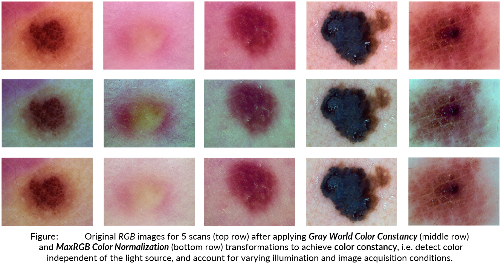
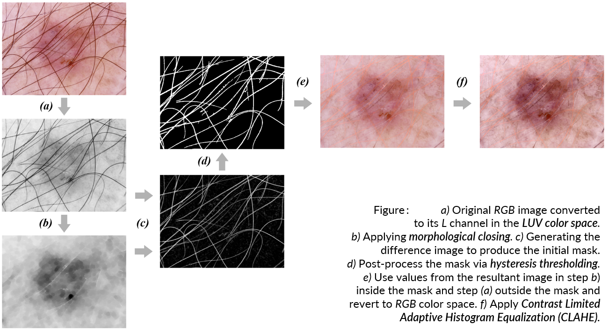
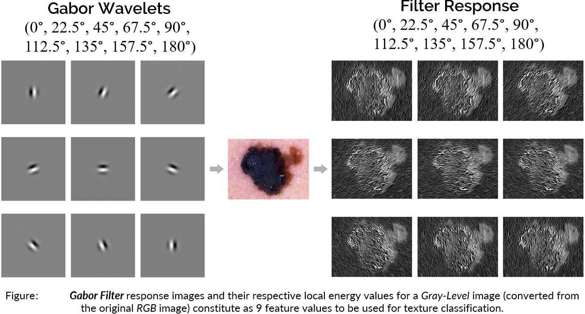
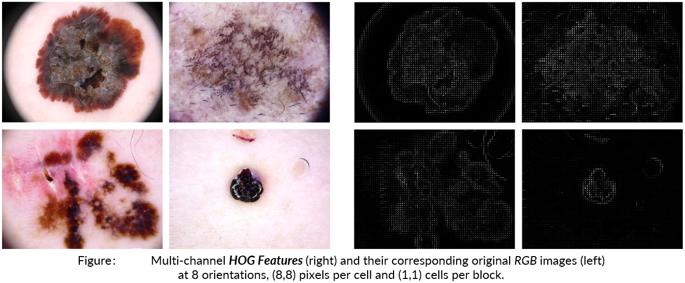

# The *Classical* Approach: Color/Texture Features with Support Vector Machine and Random Forest
**Problem Statement**: Fully supervised binary classification of skin lesions from dermatoscopic images. 

**Data**: *Class A*: Nevus; *Class B:* Other (Melanoma, Dermatofibroma, Pigmented Bowen's, Basal Cell Carcinoma, Vascular, Pigmented Benign Keratoses). 
 
**Directories**  
  ● Convert DICOM to NIfTI Volumes: `preprocess/prime/DICOM_NIFTI.py`  
  ● Resample NIfTI Volume Resolutions: `preprocess/prime/resampleRes.py`  
  ● Infer StFA/DyFA Segmentation Sub-Model (DenseVNet): `python net_segment.py inference -c '../config.ini'`  
  ● Preprocess Full Dataset to Optimized I/O HDF5 Training Patch-Volumes: `preprocess/prime/preprocess_alpha.py`               

## Color Constancy  

   
    
## Occlusion Removal  

  
    
## Unsupervised Segmentation 
 

## Color Space 

## Gabor Filter Features

## HOG Features 
 

## Feature Selection
 

## Experimental Results

