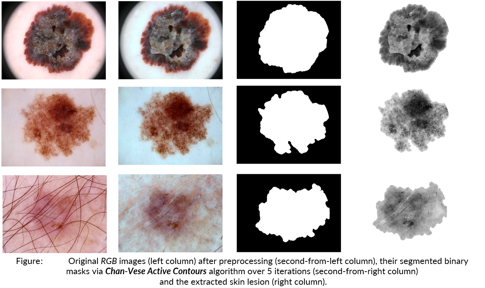
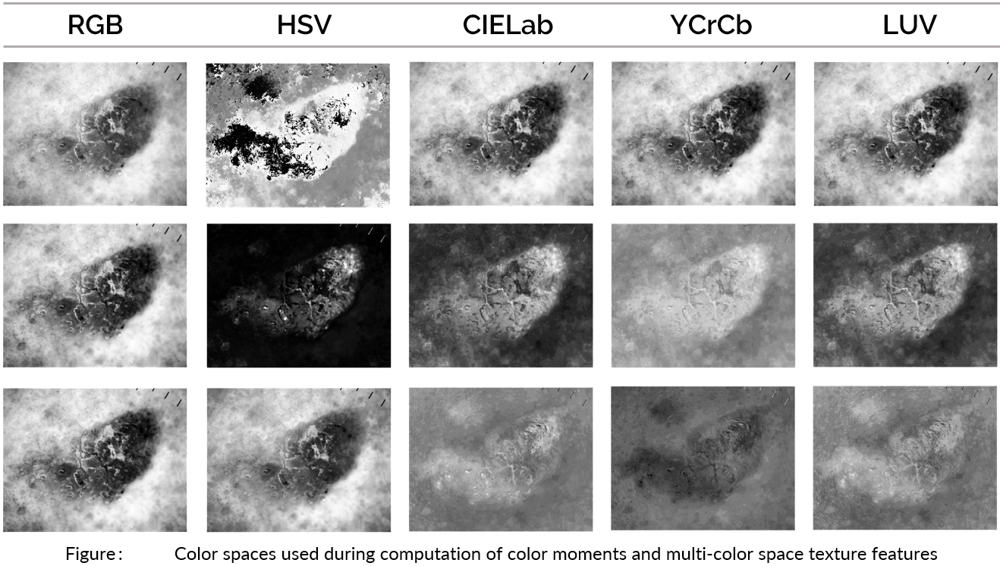
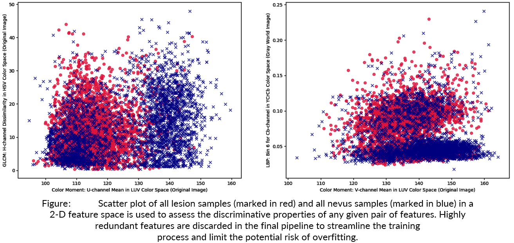

# The *Classical* Approach: Color/Texture Features with Support Vector Machine and Random Forest
**Problem Statement**: Fully supervised binary classification of skin lesions from dermatoscopic images. 

**Data**: *Class A*: Nevus; *Class B:* Other (Melanoma, Dermatofibroma, Pigmented Bowen's, Basal Cell Carcinoma, Vascular, Pigmented Benign Keratoses). 
 
**Directories**  
  ● Data I/O Functions: `scripts/dataio.py`  
  ● Preprocessing Functions: `scripts/preprocess.py`  
  ● Unsupervised Segmentation Functions: `scripts/segment.py`  
  ● Feature Computation Functions: `scripts/colorfeatures.py`               
  ● Final Feature Extraction Function: `scripts/feature_extraction.py`               
  ● Classifier Support Functions: `scripts/classify.py`  
  ● Inference Pipeline Notebook: `scripts/predict.ipynb`  
  ● Training-Validation Pipeline Notebook: `scripts/train-val.ipynb` 

## Color Constancy  

 
   
    
## Occlusion Removal  

 
  
    
## Unsupervised Segmentation 

 

## Color Space 
 

## Gabor Filter Features
 

## HOG Features 
 

## Feature Selection

 

## Experimental Results

 

